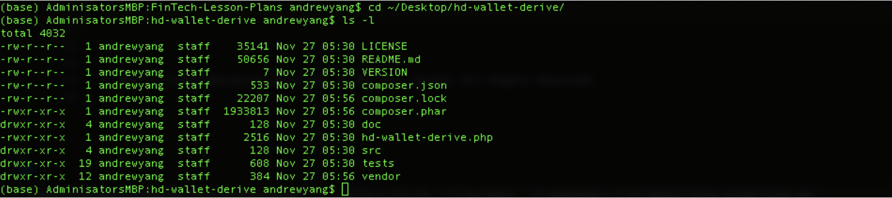
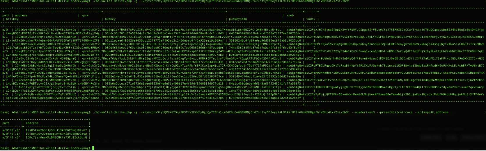
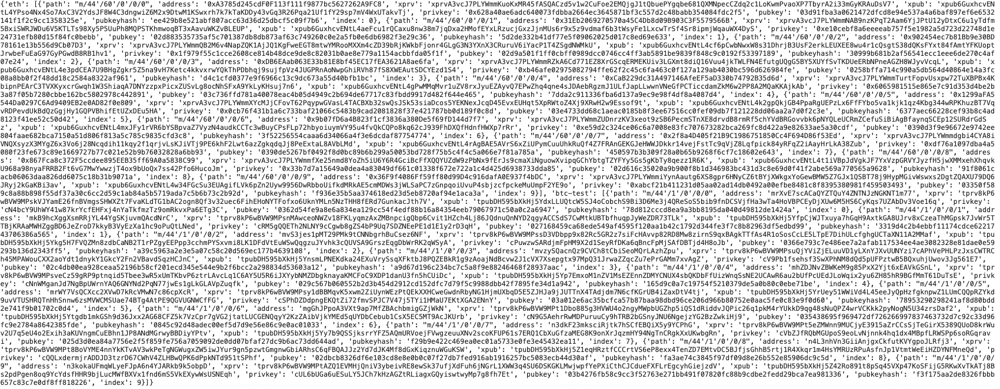
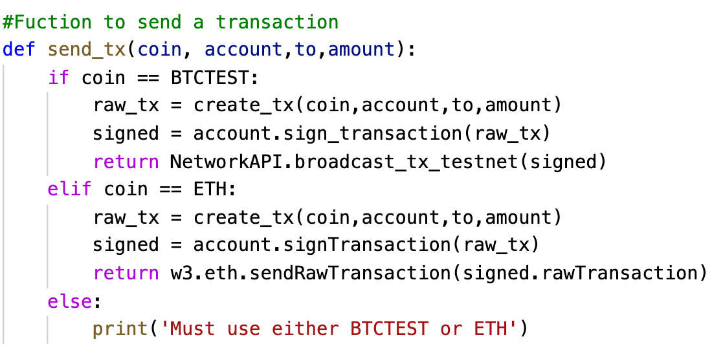

# **Multi-BlockChain Wallet in Python**

## **Background and Wallet Description**

There aren't a lot of tools available in Python for managing multiple kind of currencies in one single wallet. Fortunatelly we have a command line tool, hd-wallet-derive that supports not only BIP32, BIP39, and BIP44, but also supports non-standard derivation paths for the most popular wallets out there today.

hd-wallet-derive is a "universal" wallet and can manage billions of addresses across a bunch of coins.

In this case, let's make only get 2 coins work: Ethereum and Bitcoin Testnet. Ethereum keys are the same format on any network, so the Ethereum keys should work with a custom networks or testnets.

## **Dependencies**
PHP must be installed on your operating system (any version, 5 or 7).

Clone the [hd-wallet-derive](https://github.com/dan-da/hd-wallet-derive) tool.

[bit](https://ofek.dev/bit/) Python Bitcoin library.

[web3.py](https://github.com/ethereum/web3.py) Python Ethereum library.

### **Instructions**

## **HD Derive Wallet Install Guide**
This guide serves as a step by step process for setting up the [hd-wallet-derive library](https://github.com/dan-da/hd-wallet-derive) used to derive BIP32 addresses and private keys for Bitcoin and other alternative coins or "altcoins."

### **hd-wallet-derive Installation**
After installing PHP in our computers we can install the `hd-wallet-derive` library.

- Navigate to the [Github website](https://github.com/dan-da/hd-wallet-derive) for the `hd-wallet-derive` library and scroll down to the installation part.

- Next execute this commands:

`git clone https://github.com/dan-da/hd-wallet-derive`

`cd hd-wallet-derive`

`php -r "readfile('https://getcomposer.org/installer');" | php`

`php -d pcre.jit=0 composer.phar install`

- Afer that, you should have a folder called `hd-wallet-derive` that contains the PHP library.

### **hd-wallet-derive Execution**

- Using terminal/git bash navigate to the `hd-wallet-derive` folder.

Run the following commands.
`./hd-wallet-derive.php -g --key=xprv9tyUQV64JT5qs3RSTJkXCWKMyUgoQp7F3hA1xzG6ZGu6u6Q9VMNjGr67Lctvy5P8oyaYAL9CAWrUE9i6GoNMKUga5biW6Hx4tws2six3b9c`

`./hd-wallet-derive.php -g --key=xprv9tyUQV64JT5qs3RSTJkXCWKMyUgoQp7F3hA1xzG6ZGu6u6Q9VMNjGr67Lctvy5P8oyaYAL9CAWrUE9i6GoNMKUga5biW6Hx4tws2six3b9c --numderive=3 --preset=bitcoincore --cols=path,address --path-change`

### Wallet.py-file
This file runs all the functions that interact with hd-wallet-derive using the command line. The function below calls out the dictionary of coins with addresses and privkeys.

`def derive_wallets(coin):`

`   command = './derive -g --mnemonic="{mnemonic}" --cols=path, address, privkey, pubkey --format=json --coin="{coin}" --numderive= 2'`

`   p = subprocess.Popen(command, stdout=subprocess.PIPE, shell=True)`
`   (output, error) = p.communicate()`

`   p_status = p.wait()`

`   keys = json.loads(output)`
`   return keys`

`coins = {
    ETH: derive_wallets(ETH),
    BTCTEST: derive_wallets(BTCTEST)
    }`

    `print(coins)`

    

    To transfer money from one account to another you will need to run send_tx functions.

    
    